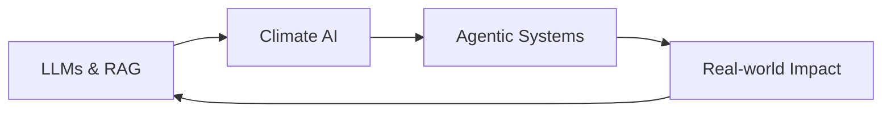

# Hi there! I'm Geetika Vasistha

  

### AI Engineer | LLM Specialist | Climate Tech Enthusiast

*Building intelligent, context-aware systems that solve real-world problems*

---

## About Me

I'm passionate about the intersection of **AI, climate science, and real-world impact**. Currently diving deep into:

⭐ **LLMs & Generative AI** - Building sophisticated language models and applications
⭐ **RAG Pipelines** - Creating context-aware retrieval systems
⭐ **Model Context Protocol (MCP)** - Developing seamless AI integrations
⭐ **Climate AI** - Leveraging AI for environmental solutions
⭐ **Agentic AI** - Building autonomous, goal-oriented AI systems

I'm hands-on with cutting-edge tools like **LangChain**, **LlamaIndex**, **Pinecone**, and **Hugging Face**, while continuously expanding my expertise in **Machine Learning**, **Deep Learning**, and **data engineering**.

### What I'm Looking For

I'm *especially* interested in collaborating with:
⭐ **Innovative startups** pushing boundaries
⭐ **Research-driven teams** solving complex problems  
⭐ **Early-stage companies** using **AI, data science, and automation**
⭐ **Climate tech organizations** making environmental impact

**Ready to build something amazing together?** Let's connect and create the future!

---
## Connect With Me

 

---

## Tech Arsenal

      

    

   

   

   

    

---

## GitHub Analytics

### Contribution Stats

### Contribution Streak

### Most Used Languages

### GitHub Contribution Snake

### Detailed GitHub Metrics

### GitHub Trophies

---

## Current Focus

⭐ Researching **multimodal AI applications** in climate science
⭐ Building **scalable RAG architectures** for enterprise solutions  
⭐ Developing **autonomous AI agents** for complex problem-solving
⭐ Contributing to **open-source climate tech** initiatives

---

## Fun Facts

⭐ Passionate about using AI to tackle climate change
⭐ Always learning and experimenting with new AI frameworks
⭐ Goal: Make AI accessible and beneficial for everyone
⭐ Powered by curiosity and good coffee

---

*Let's build something extraordinary together!* 

